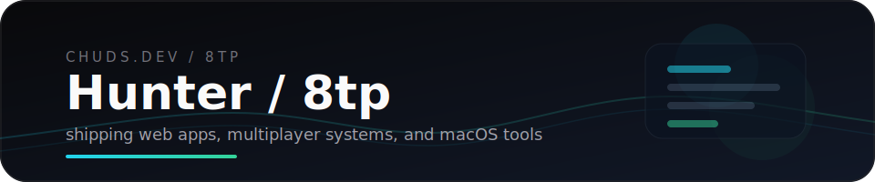

  

  <samp>full-stack web · real-time multiplayer · CLI & TUI tools · macOS utilities</samp>

  
  
  

  
  
  
  
  
  
  
  
  
  

 

> Indie builder behind [chuds.dev](https://chuds.dev). I ship browser games, full-stack web apps, terminal tools, and macOS utilities — with a bias toward stuff that actually works.

 

## ⚔️ Web Apps & Games

| | Project | Description | Stack | Live |
|:-:|:--------|:------------|:------|:----:|
| 🎯 | [**HudAim**](https://github.com/8tp/hudaim) | Browser-based aim trainer — 6 game modes, replays, leaderboards, anti-cheat | React · Tailwind · Node · Express · IndexedDB | [aim.chuds.dev](https://aim.chuds.dev/) |
| ⚡ | [**TypeDuel**](https://github.com/8tp/typeduel) | Real-time multiplayer typing combat — MonkeyType meets a fighting game | React · Vite · TypeScript · WebSockets · Zustand | [duel.chuds.dev](https://duel.chuds.dev/) |
| 🃏 | [**Coup**](https://github.com/8tp/Coup) | Real-time multiplayer bluffing card game with bots and room codes | Next.js · TypeScript · Socket.io · Tailwind · Zustand | [coup.chuds.dev](https://coup.chuds.dev) |
| 🧠 | [**iq-test**](https://github.com/8tp/iq-test) | Open-source cognitive assessment — 35 timed questions across 4 domains | HTML · CSS · JavaScript | [take the test](https://8tp.github.io/iq-test/) |

## 🖥️ CLI / TUI Tools

| | Project | Description | Stack |
|:-:|:--------|:------------|:------|
| 🌿 | [**ghgarden**](https://github.com/8tp/ghgarden) | GitHub contribution visualizer TUI — heatmaps, streak stats, language breakdowns, 6 color themes | Rust · Ratatui |
| 🗺️ | [**netmap**](https://github.com/8tp/netmap) | Visual network topology mapper and scanner — discover devices, scan ports, measure latency | Go |
| 🌊 | [**tidewatcher**](https://github.com/8tp/tidewatcher) | TUI system monitor with tide-inspired live charts, process views, and ASCII scenes | Rust · Ratatui |

## 🍎 macOS

| | Project | Description | Stack |
|:-:|:--------|:------------|:------|
| 🎚️ | [**AppMixer**](https://github.com/8tp/AppMixer) | Per-app volume control from the menu bar — HAL virtual audio driver | Swift · AppKit · CoreAudio |
| 📋 | [**Recopy**](https://github.com/8tp/Recopy) | Native menu bar clipboard manager — zero dependencies, fully offline | Swift · SwiftUI · SwiftData |
| 📊 | [**LiteStats**](https://github.com/8tp/LiteStats) | Lightweight menu bar system monitor — CPU, RAM, storage, battery, thermals | Swift · SwiftUI · IOKit |

## 🌐 Portfolio

| | Project | Description | Stack | Live |
|:-:|:--------|:------------|:------|:----:|
| 🏠 | [**chuds.dev**](https://github.com/8tp/chuds.dev) | Portfolio site and launchpad for everything above | HTML · Tailwind · JavaScript | [chuds.dev](https://chuds.dev) |

 

---

 

  
  

  
  

  

