

  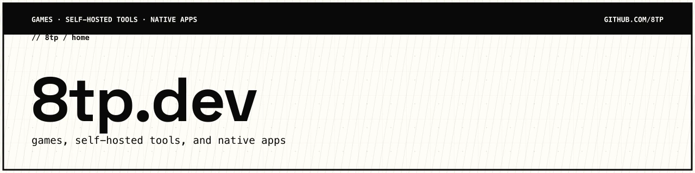

  <samp><strong>CHUDS.DEV MAG</strong> / VOL. 2026 / ISSUE 01 / GITHUB PROFILE EDITION</samp>

  
  
  

<table>
<tr>
<td width="178" align="center" valign="top">
  
   
  <samp>// cover star / @8tp</samp>
</td>
<td valign="top">
  <h1>Hunter / 8tp</h1>
  
<samp><strong>premium software, engineered from the basement</strong></samp>

  

    Indie developer shipping browser games, real-time multiplayer systems,
    terminal interfaces, and native macOS tools. Current focus: playable web
    projects, offline-first desktop utilities, and terminal apps that make
    dense data easier to read.
  

  

    <samp>code the tool. ship the game. keep it sharp.</samp>
  

</td>
</tr>
</table>

  <samp>
    <a href="#p-001--editors-letter">p.001 editor's letter</a>
    /
    <a href="#p-002--live-games-on-the-cover">p.002 live games</a>
    /
    <a href="#p-003--terminal-department">p.003 terminal dept</a>
    /
    <a href="#p-004--macos-back-matter">p.004 macOS</a>
    /
    <a href="#p-005--back-cover">p.005 back cover</a>
  </samp>

  <samp>----------------------------------------------------------------------</samp>

## <samp>p.001 // editor's letter</samp>

> <samp>// opening monologue</samp>
>
> Hey, I'm Hunter. I build small, sharp software: games that boot in the
> browser, tools that live in the menu bar, and terminal apps that make dense
> data feel readable. This issue's cover star is
> <a href="https://instagib.win">Instagib Arena</a> — a one-shot railgun FPS
> with real netcode, free in the browser. Live games first, terminal
> utilities next, native macOS apps after that, and chuds.dev as the
> launchpad for the whole set.

  <samp>
    stack index /
    TypeScript / React / Next.js / Astro / Svelte / Tailwind /
    Three.js / Node.js / WebSocket / Socket.io / Rust / Ratatui /
    Go / Bubble Tea / Swift / SwiftUI / AppKit / Canvas 2D / Web Audio
  </samp>

  <samp>----------------------------------------------------------------------</samp>

## <samp>p.002 // live games on the cover</samp>

<table>
<tr>
<td width="290" align="center" valign="top">
  <a href="https://instagib.win">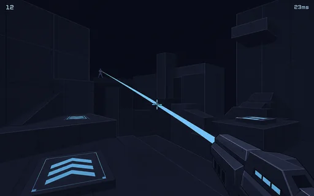</a>
   
  <samp>cover feature / live</samp>
</td>
<td valign="top">
  <h3><a href="https://github.com/8tp/instagib-arena">Instagib Arena</a> / <a href="https://instagib.win">instagib.win</a></h3>
  

    Quake-style instagib FPS in the browser. One-shot railgun, strafe-jump
    movement, and server-authoritative 64 Hz binary netcode with lag
    compensation — plus ranked duels, weekly replay challenges, and offline
    bots. Free, no download.
  

  
<samp>[Three.js] [React 19] [Node/ws] [SQLite]</samp>

</td>
</tr>
<tr>
<td width="290" align="center" valign="top">
  <a href="https://ant.chuds.dev">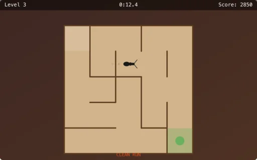</a>
   
  <samp>maze page / live</samp>
</td>
<td valign="top">
  <h3><a href="https://github.com/8tp/AntMaze">AntMaze</a> / <a href="https://ant.chuds.dev">ant.chuds.dev</a></h3>
  

    Perpetual-motion maze game where the ant never stops moving. Procedural
    7x7 to 21x21 mazes, LBP-inspired Web Audio soundtrack, and a tiny shipped
    payload.
  

  
<samp>[TypeScript] [Vite] [Canvas 2D] [Web Audio]</samp>

</td>
</tr>
<tr>
<td width="290" align="center" valign="top">
  <a href="https://aim.chuds.dev">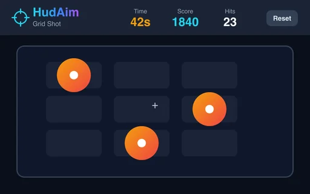</a>
   
  <samp>training spread / live</samp>
</td>
<td valign="top">
  <h3><a href="https://github.com/8tp/hudaim">HudAim</a> / <a href="https://aim.chuds.dev">aim.chuds.dev</a></h3>
  

    Browser aim trainer with six modes, 60 FPS replay capture, LAN
    leaderboards, and HMAC-SHA256 anti-cheat.
  

  
<samp>[React 19] [Tailwind] [Node/Express] [IndexedDB]</samp>

</td>
</tr>
<tr>
<td width="290" align="center" valign="top">
  <a href="https://coup.chuds.dev">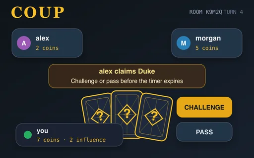</a>
   
  <samp>table game / live</samp>
</td>
<td valign="top">
  <h3><a href="https://github.com/8tp/Coup">Coup</a> / <a href="https://coup.chuds.dev">coup.chuds.dev</a></h3>
  

    Real-time multiplayer bluffing card game with bots, room codes,
    mobile-friendly play, and no account wall.
  

  
<samp>[Next.js] [TypeScript] [Socket.io] [Zustand]</samp>

</td>
</tr>
<tr>
<td width="290" align="center" valign="top">
  <a href="https://duel.chuds.dev">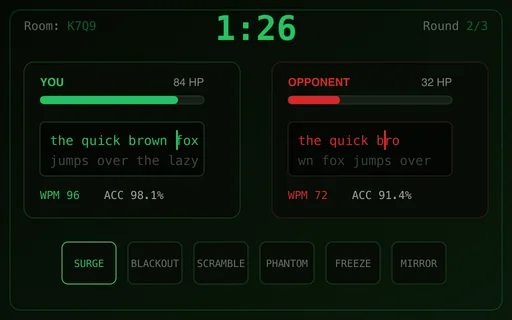</a>
   
  <samp>versus page / live</samp>
</td>
<td valign="top">
  <h3><a href="https://github.com/8tp/typeduel">TypeDuel</a> / <a href="https://duel.chuds.dev">duel.chuds.dev</a></h3>
  

    Real-time multiplayer typing game. Type fast, deal damage, trigger
    abilities, and win the duel in the browser.
  

  
<samp>[TypeScript] [React] [WebSocket] [Zustand]</samp>

</td>
</tr>
</table>

<samp>// bonus page: <a href="https://8tp.github.io/iq-test/">iq-test</a> / open-source 35-question cognitive assessment / [HTML] [CSS] [JS]</samp>

  <samp>----------------------------------------------------------------------</samp>

## <samp>p.003 // terminal department</samp>

<table>
<tr>
<td width="290" align="center" valign="top">
  <a href="https://github.com/8tp/ghgarden">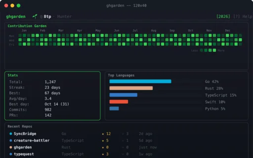</a>
   
  <samp>repo heatmap / tui</samp>
</td>
<td valign="top">
  <h3><a href="https://github.com/8tp/ghgarden">ghgarden</a></h3>
  

    GitHub contribution visualizer for the terminal: heatmaps, streak stats,
    language breakdowns, and six themes.
  

  
<samp>[Rust] [Ratatui]</samp>

</td>
</tr>
<tr>
<td width="290" align="center" valign="top">
  <a href="https://github.com/8tp/netmap">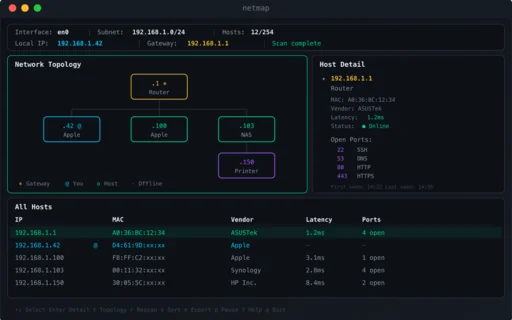</a>
   
  <samp>network map / tui</samp>
</td>
<td valign="top">
  <h3><a href="https://github.com/8tp/netmap">netmap</a></h3>
  

    Visual network topology mapper and scanner. Discover devices, scan ports,
    and measure latency from a terminal UI.
  

  
<samp>[Go] [Bubble Tea]</samp>

</td>
</tr>
<tr>
<td width="290" align="center" valign="top">
  <a href="https://github.com/8tp/tidewatcher">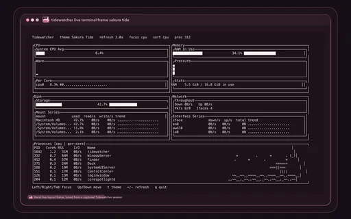</a>
   
  <samp>system monitor / tui</samp>
</td>
<td valign="top">
  <h3><a href="https://github.com/8tp/tidewatcher">TideWatcher</a></h3>
  

    System monitor TUI with tide-inspired live charts, process views, and
    theme-aware ASCII scenes.
  

  
<samp>[Rust] [Ratatui]</samp>

</td>
</tr>
</table>

  <samp>----------------------------------------------------------------------</samp>

## <samp>p.004 // macOS back matter</samp>

<table>
<tr>
<td width="290" align="center" valign="top">
  <a href="https://github.com/8tp/ScreenCap">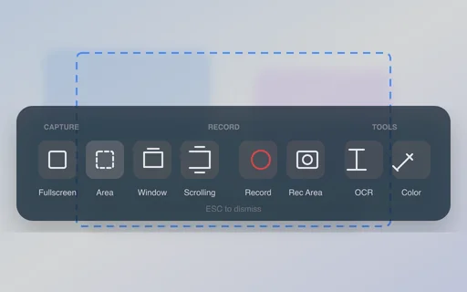</a>
   
  <samp>desktop tool / native</samp>
</td>
<td valign="top">
  <h3><a href="https://github.com/8tp/ScreenCap">ScreenCap</a></h3>
  

    Native screenshot and annotation app for macOS: area, window, scrolling
    capture, screen recording, OCR, color picker, and GIF export.
  

  
<samp>[Swift] [SwiftUI] [AppKit] [ScreenCaptureKit]</samp>

</td>
</tr>
<tr>
<td width="290" align="center" valign="top">
  <a href="https://github.com/8tp/Recopy">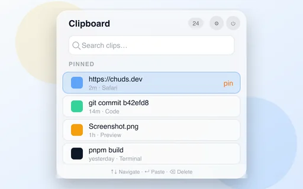</a>
   
  <samp>clipboard page / native</samp>
</td>
<td valign="top">
  <h3><a href="https://github.com/8tp/Recopy">Recopy</a></h3>
  

    Native menu bar clipboard manager. Zero dependencies, fully offline, and
    built with SwiftData.
  

  
<samp>[Swift] [SwiftUI] [SwiftData]</samp>

</td>
</tr>
<tr>
<td width="290" align="center" valign="top">
  <a href="https://github.com/8tp/LiteStats">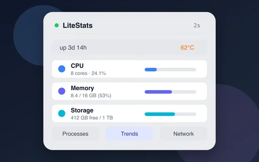</a>
   
  <samp>status strip / native</samp>
</td>
<td valign="top">
  <h3><a href="https://github.com/8tp/LiteStats">LiteStats</a></h3>
  

    Lightweight menu bar system monitor for CPU, RAM, storage, battery, and
    thermals.
  

  
<samp>[Swift] [SwiftUI] [IOKit]</samp>

</td>
</tr>
</table>

<samp>// extra page: <a href="https://github.com/8tp/AppMixer">AppMixer</a> / per-app volume from the menu bar via a HAL virtual audio driver / [Swift] [AppKit] [CoreAudio]</samp>

  <samp>----------------------------------------------------------------------</samp>

## <samp>p.005 // back cover</samp>

<table>
<tr>
<td valign="top" width="50%">
  <h3>chuds.dev</h3>
  

    Portfolio site and launchpad for the projects above. It collects the
    playable apps, repo writeups, project thumbnails, and build notes in one
    place.
  

  

    <a href="https://chuds.dev">read the issue</a>
    /
    <a href="https://github.com/8tp/chuds.dev">view source</a>
  

  
<samp>[Astro] [Svelte] [Tailwind]</samp>

</td>
<td valign="top" width="50%">
  <h3>current focus</h3>
  

    Realtime browser games with serious netcode, native macOS utilities,
    terminal interfaces, and project pages that explain what shipped, how it
    works, and where to try it.
  

  
<samp>$ shipping web apps, multiplayer systems, and macOS tools</samp>

</td>
</tr>
</table>

  
  

  
  

  

  <samp>back cover / chuds.dev / project index / engineered from the basement</samp>

