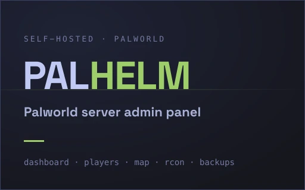
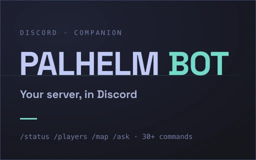

  

  
  
  

<table>
<tr>
<td width="178" align="center" valign="top">
  
   
  <samp>@8tp</samp>
</td>
<td valign="top">
  <h1>Hunter / 8tp</h1>
  
<samp><strong>games, self-hosted tools, and native apps</strong></samp>

  

    I build small, fast software solo: real-time multiplayer browser games,
    self-hosted server tools, terminal apps, and native macOS utilities. Most
    of it started as something I wanted to exist, then shipped once it earned it.
  

  

    <samp>
      TypeScript / React / Next.js / Three.js / Node / WebSocket /
      Go / Rust / Ratatui / Swift / SwiftUI / AppKit / Docker
    </samp>
  

</td>
</tr>
</table>

  <samp>
    <a href="#featured">featured</a>
    /
    <a href="#browser-games">browser games</a>
    /
    <a href="#terminal-apps">terminal apps</a>
    /
    <a href="#macos-apps">macOS apps</a>
  </samp>

---

## <samp>Featured</samp>

<table>
<tr>
<td width="290" align="center" valign="top">
  
</td>
<td valign="top">
  <h3><a href="https://github.com/8tp/palhelm">Palhelm</a> / <a href="https://palhelm.com">palhelm.com</a></h3>
  

    Self-hosted web admin panel for Palworld dedicated servers. One Docker
    image with no external database. It talks to the server three ways: the
    official REST API, RCON, and the world save file, which it parses directly
    in pure Go. You get a live dashboard, player and Pal data, a world map, an
    RCON console, and scheduled backups with dry-run restores.
  

  
<samp>[Go] [Svelte] [Docker] [RCON]</samp>

</td>
</tr>
<tr>
<td width="290" align="center" valign="top">
  
</td>
<td valign="top">
  <h3><a href="https://github.com/8tp/palhelm-bot">Palhelm Bot</a> / <a href="https://docs.palhelm.com">docs.palhelm.com</a></h3>
  

    Discord companion for Palhelm. It posts live server events into a channel
    and answers more than 30 slash commands for players, guilds, Pal ownership,
    breeding, and records, with rendered world-map and Pal images. Reads run
    through the panel's read-only integration API, which redacts platform IDs,
    live positions, and ban state so replies are safe in a public channel.
  

  
<samp>[TypeScript] [discord.js] [Node.js]</samp>

</td>
</tr>
<tr>
<td width="290" align="center" valign="top">
  
</td>
<td valign="top">
  <h3><a href="https://github.com/8tp/instagib-arena">Instagib Arena</a> / <a href="https://instagib.win">instagib.win</a></h3>
  

    Quake-style instagib FPS in the browser. One-shot railgun, strafe-jump
    movement, and server-authoritative 64 Hz binary netcode with lag
    compensation. Ranked duels, weekly replay challenges, and offline bots.
    Free, no download.
  

  
<samp>[Three.js] [React 19] [Node/ws] [SQLite]</samp>

</td>
</tr>
</table>

---

## <samp>Browser games</samp>

<table>
<tr>
<td width="290" align="center" valign="top">
  
</td>
<td valign="top">
  <h3><a href="https://github.com/8tp/Coup">Coup</a> / <a href="https://coup.8tp.dev">coup.8tp.dev</a></h3>
  

    Real-time multiplayer bluffing card game with bots, room codes, and
    mobile-friendly play. No install, no accounts.
  

  
<samp>[Next.js] [TypeScript] [Socket.io] [Zustand]</samp>

</td>
</tr>
<tr>
<td width="290" align="center" valign="top">
  
</td>
<td valign="top">
  <h3><a href="https://github.com/8tp/hudaim">HudAim</a> / <a href="https://aim.8tp.dev">aim.8tp.dev</a></h3>
  

    Browser aim trainer with six game modes, 60 FPS replay capture, LAN
    leaderboards, and HMAC-SHA256 anti-cheat.
  

  
<samp>[React 19] [Tailwind] [Node/Express] [IndexedDB]</samp>

</td>
</tr>
<tr>
<td width="290" align="center" valign="top">
  
</td>
<td valign="top">
  <h3><a href="https://github.com/8tp/AntMaze">AntMaze</a> / <a href="https://ant.8tp.dev">ant.8tp.dev</a></h3>
  

    Perpetual-motion maze game where the ant never stops moving. Procedural
    7x7 to 21x21 mazes, an LBP-inspired Web Audio soundtrack, and a 10 KB
    gzipped payload.
  

  
<samp>[TypeScript] [Vite] [Canvas 2D] [Web Audio]</samp>

</td>
</tr>
<tr>
<td width="290" align="center" valign="top">
  
</td>
<td valign="top">
  <h3><a href="https://github.com/8tp/typeduel">TypeDuel</a> / <a href="https://duel.8tp.dev">duel.8tp.dev</a></h3>
  

    Real-time multiplayer typing combat. Type fast, deal damage, trigger
    abilities, and win the duel in the browser.
  

  
<samp>[TypeScript] [React] [WebSocket] [Zustand]</samp>

</td>
</tr>
</table>

<samp>Also: <a href="https://8tp.github.io/iq-test/">iq-test</a>, an open-source 35-question cognitive assessment. [HTML] [CSS] [JS]</samp>

---

## <samp>Terminal apps</samp>

<table>
<tr>
<td width="290" align="center" valign="top">
  
</td>
<td valign="top">
  <h3><a href="https://github.com/8tp/ghgarden">ghgarden</a></h3>
  

    GitHub contribution visualizer for the terminal, with heatmaps, streak
    stats, language breakdowns, and six themes.
  

  
<samp>[Rust] [Ratatui]</samp>

</td>
</tr>
<tr>
<td width="290" align="center" valign="top">
  
</td>
<td valign="top">
  <h3><a href="https://github.com/8tp/netmap">netmap</a></h3>
  

    Visual network topology mapper and scanner. Discover devices, scan ports,
    and measure latency from a terminal UI.
  

  
<samp>[Go] [Bubble Tea]</samp>

</td>
</tr>
<tr>
<td width="290" align="center" valign="top">
  
</td>
<td valign="top">
  <h3><a href="https://github.com/8tp/tidewatcher">TideWatcher</a></h3>
  

    System monitor TUI with tide-inspired live charts, process views, and
    theme-aware ASCII scenes.
  

  
<samp>[Rust] [Ratatui]</samp>

</td>
</tr>
</table>

---

## <samp>macOS apps</samp>

<table>
<tr>
<td width="290" align="center" valign="top">
  
</td>
<td valign="top">
  <h3><a href="https://github.com/8tp/ScreenCap">ScreenCap</a></h3>
  

    Native screenshot and annotation app for macOS. Area, window, and scrolling
    capture, screen recording, OCR, color picker, and GIF export.
  

  
<samp>[Swift] [SwiftUI] [AppKit] [ScreenCaptureKit]</samp>

</td>
</tr>
<tr>
<td width="290" align="center" valign="top">
  
</td>
<td valign="top">
  <h3><a href="https://github.com/8tp/Recopy">Recopy</a></h3>
  

    Native menu bar clipboard manager. Zero dependencies, fully offline, built
    with SwiftData.
  

  
<samp>[Swift] [SwiftUI] [SwiftData]</samp>

</td>
</tr>
<tr>
<td width="290" align="center" valign="top">
  
</td>
<td valign="top">
  <h3><a href="https://github.com/8tp/LiteStats">LiteStats</a></h3>
  

    Lightweight menu bar system monitor for CPU, RAM, storage, battery, and
    thermals.
  

  
<samp>[Swift] [SwiftUI] [IOKit]</samp>

</td>
</tr>
</table>

<samp>Also: <a href="https://github.com/8tp/AppMixer">AppMixer</a>, per-app volume from the menu bar via a HAL virtual audio driver. [Swift] [AppKit] [CoreAudio]</samp>

---

<table>
<tr>
<td valign="top" width="50%">
  <h3>8tp.dev</h3>
  

    Portfolio site for the projects above. It collects the playable apps, repo
    links, thumbnails, and build notes in one place.
  

  

    <a href="https://8tp.dev">8tp.dev</a>
    /
    <a href="https://github.com/8tp/8tp.dev">source</a>
  

  
<samp>[Astro] [Svelte] [Tailwind]</samp>

</td>
<td valign="top" width="50%">
  <h3>Current focus</h3>
  

    Browser games with server-authoritative netcode, self-hosted server tools,
    and native macOS and terminal utilities. Each project page says what
    shipped, how it works, and where to try it.
  

</td>
</tr>
</table>

  
  

  <samp>github.com/8tp</samp>

